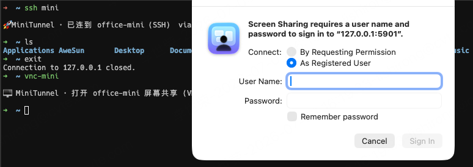
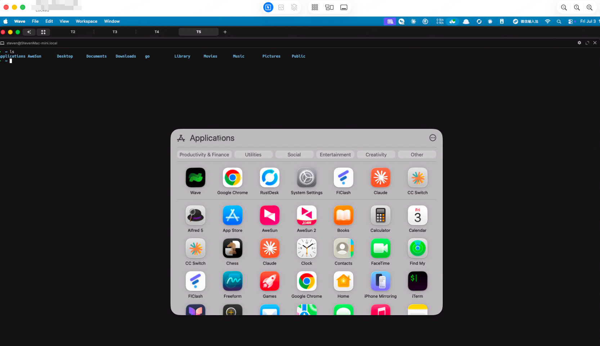
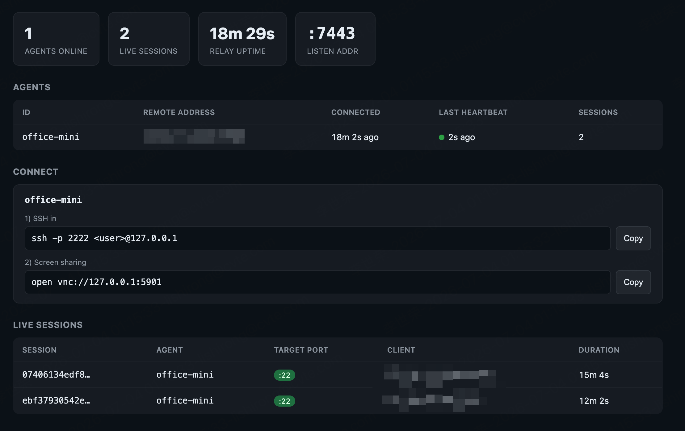

# MiniTunnel

**A tiny, self-hosted reverse tunnel to reach a machine behind NAT with a
changing IP — SSH and remote-desktop into your office Mac from home, over
infrastructure you own.**

[](https://github.com/StevenSixon/MiniTunnel/actions/workflows/ci.yml)
[](https://goreportcard.com/report/github.com/StevenSixon/MiniTunnel)
[](https://pkg.go.dev/github.com/StevenSixon/MiniTunnel)
[](LICENSE)
[](go.mod)
[](#why-minitunnel)
[](CONTRIBUTING.md)

MiniTunnel does **not** reinvent SSH or VNC. It builds the one thing you're
missing — the *transport*: a pinned-TLS tunnel through a relay you control, then
forwards your terminal (SSH) and remote desktop (macOS Screen Sharing) over it.
Because the office machine only ever dials **out** to the relay, NAT and a
rotating office IP are non-issues, and you get locked-screen login + adaptive
image quality for free from macOS's own `sshd` and `screensharingd`.

No account. No SaaS. No agent phoning home to a vendor. Four small Go binaries
and a certificate you generate yourself — about 1,500 lines you can read in an
afternoon.

```
        relay host — VPS or internal server (you run it)
               ┌────────────────────────┐
               │         relay          │
               └───────────┬────────────┘
       control + sessions  │  sessions
        ┌──────────────────┴──────────────────┐
   ┌────┴─────┐                          ┌─────┴─────┐
   │  agent   │  office Mac mini         │  client   │  home Mac Pro
   │ dials out│                          │ local fwd │
   └────┬─────┘                          └─────┬─────┘
   127.0.0.1:22  (sshd)            ssh -p 2222 you@127.0.0.1
   127.0.0.1:5900 (Screen Sharing) open vnc://127.0.0.1:5901
```

## See it in action

From home, `ssh mini` drops you into a shell on the office machine, and
`vnc-mini` opens its screen through the same tunnel — the native macOS Screen
Sharing login, working even at the lock screen:



Once authenticated, it's the real desktop — full resolution, adaptive quality,
all from macOS's own `screensharingd` over the encrypted tunnel:



The relay's built-in dashboard shows connection state at a glance — which agents
are online, their heartbeats, live sessions with target ports and durations, and
copy-paste connect commands per agent:



## Why MiniTunnel

Remote-access tools ask you to route your keystrokes and screen through
*their* servers, or to trust a mesh VPN's coordination plane. MiniTunnel is for
people who would rather own the whole path.

| | MiniTunnel | ngrok / Cloudflare Tunnel | Tailscale / ZeroTier | TeamViewer / AnyDesk |
|---|---|---|---|---|
| Traffic path | **A relay you run** | Vendor edge | Vendor coordination + P2P | Vendor cloud |
| Account / sign-up | **None** | Required | Required | Required |
| Trust anchor | **A cert you generate** | Vendor TLS | Vendor identity | Vendor |
| Data leaves your control | **No** | Yes | Metadata / relays | Yes |
| Locked-screen desktop login | **Yes** (native Screen Sharing) | n/a | via native VNC | Yes |
| Cost | **Free** (a small VPS or an internal box) | Freemium | Freemium | Paid for commercial |
| Footprint | **~1,500 LoC, stdlib + 1 dep** | Closed source | Closed core | Closed source |

It's not trying to beat those on features — it's the answer when the requirement
is *"nothing I don't run myself touches this traffic."*

## Features

- 🔒 **Pinned-TLS end to end.** Every link is TLS; the agent and client pin the
  relay's self-signed cert to a fixed SAN, so the relay's IP/hostname can change
  freely and there's no CA to manage.
- 🔑 **PSK-authenticated.** A pre-shared key (constant-time compared) gates every
  connection, on top of TLS.
- 🚪 **Dials out only.** The target machine never accepts inbound connections —
  NAT, firewalls, and a rotating office IP are all non-issues.
- 🛡️ **Port allowlist.** The agent will only reach ports you list (default
  `22,5900`); a client can't pivot it onto arbitrary hosts/ports.
- ♻️ **Self-healing.** Heartbeats detect dead links; the agent auto-reconnects
  every 3s, so relay restarts, Wi-Fi blips, and IP changes recover on their own.
- 🌐 **Runs behind any gateway.** Direct TLS, SNI-routed L4, or tunneled inside a
  WebSocket for L7-only PaaS gateways — the pinned TLS stays end to end in all
  three.
- 📊 **Built-in dashboard + healthcheck.** A read-only status page and `/healthz`
  for load balancers and container probes.
- 🪶 **Tiny and auditable.** Pure Go, stdlib-only save for one deliberate
  dependency. No telemetry, no phone-home.

## Quick start

With Go 1.23+ installed you can grab the binaries directly:

```sh
go install github.com/StevenSixon/MiniTunnel/cmd/relay@latest
go install github.com/StevenSixon/MiniTunnel/cmd/agent@latest
go install github.com/StevenSixon/MiniTunnel/cmd/client@latest
go install github.com/StevenSixon/MiniTunnel/cmd/gencert@latest
```

Then, in three terminals sharing one PSK:

```sh
export MINITUNNEL_PSK="$(openssl rand -hex 24)"   # share this across all three

gencert                                            # writes cert.pem + key.pem
relay  -addr :7000 -cert cert.pem -key key.pem     # on the relay host
agent  -relay RELAY_HOST:7000 -cert cert.pem -id office-mini   # on the target
client -relay RELAY_HOST:7000 -cert cert.pem -agent office-mini # where you are

ssh -p 2222 you@127.0.0.1                          # terminal, through the tunnel
open vnc://127.0.0.1:5901                           # screen, works at the lock screen
```

That's the whole thing. The rest of this README is the production deployment
(systemd/LaunchDaemon, cloud gateways, containers) and the details behind each
step.

## Components

| Binary    | Runs on            | Role                                                        |
|-----------|--------------------|-------------------------------------------------------------|
| `relay`   | VPS *or* internal server | Rendezvous: matches client requests to a registered agent. |
| `agent`   | office Mac mini    | Dials out, stays connected, bridges sessions to local ports.|
| `client`  | home Mac Pro       | Opens local ports that forward through the relay.           |
| `gencert` | once, anywhere     | Generates the relay's pinned TLS certificate.               |

## Security model

- All links are **TLS**. Clients pin the relay's self-signed certificate (SAN
  `minitunnel-relay`), so the relay's public IP can change without breaking
  trust, and there is no CA to manage.
- A **pre-shared key** authenticates every connection (constant-time compare).
  Set it via `-psk` or the `MINITUNNEL_PSK` env var. Use a long random value.
- The agent enforces a **port allowlist** (`-allow`, default `22,5900`), so a
  client can never ask it to reach arbitrary ports/hosts.

## Reliability

- **Heartbeat.** The agent's control link exchanges a Ping every 30s in both
  directions and drops the link if nothing arrives within 90s, on top of TCP
  keepalive. This detects connections silently severed by a NAT/firewall idle
  timeout instead of waiting on a stuck socket.
- **Auto-reconnect.** The agent re-dials the relay every 3s after any drop, so a
  relay restart, Wi-Fi blip, or office IP change recovers on its own.
- **Clear client errors.** The relay acknowledges each client request before
  piping, so the client logs a specific reason — `agent "X" is not online`,
  `relay unreachable`, or `no response (check PSK/certificate)` — instead of a
  silent hang. The client also retries the relay dial briefly and probes the
  relay once at startup.

## Build

```sh
go build -o bin/relay   ./cmd/relay
go build -o bin/agent   ./cmd/agent
go build -o bin/client  ./cmd/client
go build -o bin/gencert ./cmd/gencert
```

The Mac binaries cross-compile from anywhere; build the relay for your VPS, e.g.
Linux x86-64:

```sh
GOOS=linux GOARCH=amd64 go build -o bin/relay-linux ./cmd/relay
```

## Setup

> **Configuration.** Every flag below also reads from a `MINITUNNEL_*`
> environment variable, so you can drive all three programs entirely from the
> environment (handy for systemd `EnvironmentFile=`, the macOS LaunchDaemon, or a
> local `.env`). Precedence is **flag > env var > default**. See
> [`.env.example`](.env.example) for the full list: `MINITUNNEL_PSK`,
> `MINITUNNEL_CERT`, `MINITUNNEL_KEY`, `MINITUNNEL_ADDR`, `MINITUNNEL_RELAY`,
> `MINITUNNEL_ID`, `MINITUNNEL_ALLOW`, `MINITUNNEL_AGENT`, `MINITUNNEL_FORWARD`.
> A quick local run: `cp .env.example .env`, edit it, then
> `set -a; source .env; set +a` and start each binary with no flags.
>
> **No `.pem` files needed.** `MINITUNNEL_CERT`/`MINITUNNEL_KEY` (and `-cert`/
> `-key`) accept either a file path *or* inline PEM — paste the certificate/key
> straight into `.env` (multi-line, double-quoted) and there is nothing on disk
> to manage or copy around.

### 0. Generate the certificate and a key (once)

```sh
go run ./cmd/gencert            # writes cert.pem + key.pem
export MINITUNNEL_PSK="$(openssl rand -hex 24)"   # share this secret across all three
```

- `key.pem` stays **only** on the relay.
- `cert.pem` is copied to the agent and the client.
- The same `MINITUNNEL_PSK` is set on all three.

### 1. Relay

The relay can run anywhere that **both** the agent and you (the client) can
reach it — it does not have to be public. Two common placements:

- **Public VPS** — when home and office share no network.
- **Internal company server (no VPS)** — when you reach the office over a VPN
  but the VPN does *not* route to the mini's subnet. Put the relay on an
  internal host that the VPN *can* reach and that the mini can also reach, give
  it an internal DNS name, and point everything at that name. No traffic leaves
  the corporate network. The pinned certificate is keyed to the fixed SAN
  `minitunnel-relay`, so the relay's internal IP/hostname can be anything and
  can change without breaking trust.

Quick run (foreground):

```sh
MINITUNNEL_PSK=... ./relay -addr :7000 -cert cert.pem -key key.pem
```

As a managed service on a Linux host (VPS or internal server) — copy the
`relay-linux-*` binary, `cert.pem`, `key.pem` and `deploy/` to the server, then:

```sh
# internal-only relay: bind to the server's internal IP so it never listens publicly
sudo MINITUNNEL_PSK=... BIND=10.0.0.5 PORT=7000 BINARY=./relay-linux-amd64 \
  ./deploy/install-relay.sh
```

Open the port to the agent (office mini) and to your VPN client range. Build the
Linux relay binary with `GOOS=linux GOARCH=amd64 go build -o relay-linux-amd64 ./cmd/relay`
(use `arm64` for ARM servers).

#### Behind a cloud domain gateway (changing IP)

> Full walkthrough (rationale, container deploy, env reference, troubleshooting):
> [`docs/cloud-gateway-wss.md`](docs/cloud-gateway-wss.md).

On a PaaS that only exposes a **domain** (the IP changes on restart), point the
agent/client at the domain — trust is pinned to the SAN `minitunnel-relay`, not
the address, so a moving IP is a non-issue. Pick the option that matches what the
gateway can do.

**A. Raw TCP stream (L4) — preferred, zero code on the wire path.** If the
platform can route a raw TCP stream to the relay, the protocol flows unchanged:

- **Plain TCP route / port mapping** — ask for an L4 TCP route to the relay's
  listen port. Set `MINITUNNEL_RELAY=your.domain:<port>`; nothing else changes.
- **SNI-based stream route sharing :443** — when the L4 route selects the
  upstream by TLS SNI (e.g. an APISIX `stream route`), set
  `MINITUNNEL_SNI=your.domain` on the agent and client. The SNI is sent for
  routing while the cert stays pinned to `minitunnel-relay`.

**B. Only an L7 HTTP(S) gateway — tunnel over WebSocket.** Many PaaS gateways
(e.g. APISIX) terminate TLS with their own certificate and only speak HTTP, so a
raw TLS stream cannot pass. Run the relay's HTTP listener and connect over a
WebSocket instead:

1. On the relay set `MINITUNNEL_HTTP_ADDR=:8080` and point the gateway's HTTP
   route at it (the same route that serves `/healthz` and the dashboard). Enable
   WebSocket on that route (on APISIX, `enable_websocket: true`).
2. On the agent and client set the relay to the WebSocket URL:
   `MINITUNNEL_RELAY=wss://your.domain<prefix>/tunnel` (e.g.
   `wss://tunnel.example.com/api/tunnel` when `MINITUNNEL_HTTP_PREFIX=/api`). Use
   `ws://` only for a plain-HTTP gateway.

The pinned relay TLS runs **inside** the WebSocket, so the certificate is still
pinned end to end and the gateway sees only ciphertext — it never learns the PSK
or the traffic. This is the only mode that adds a dependency
(`github.com/coder/websocket`); the L4 options above use stdlib alone.

##### Running the relay as a container

For a container PaaS, `deploy/Dockerfile` builds a tiny static image and
`deploy/relay.env.example` is the ready-to-fill environment for the WebSocket
deployment above. Build from the repo **root**:

```sh
docker build -f deploy/Dockerfile -t minitunnel-relay:latest .
```

All config is via `MINITUNNEL_*` env vars (no args). Map the platform's HTTP
route and container port to **8080**, enable WebSocket on that route, and set a
liveness probe to `<prefix>/healthz` (e.g. `/api/healthz`). Cert and key go in
as single-line base64 PEM so no files live in the image — see the comments in
`deploy/relay.env.example`. To run it locally against that env file:

```sh
docker run --rm --env-file relay.env -p 8080:8080 minitunnel-relay:latest
```

### 2. Agent (office Mac mini)

First enable the macOS services it will bridge to (System Settings → General →
Sharing): **Remote Login** (SSH, port 22) and **Screen Sharing** (port 5900).
Then keep the machine awake so the tunnel survives:

```sh
sudo pmset -c sleep 0 disablesleep 1 displaysleep 0
```

Recommended — install as a LaunchDaemon so it runs at boot, even when logged
out or the screen is locked (the script also applies the `pmset` settings above):

```sh
RELAY=relay.host:7000 AGENT_ID=office-mini MINITUNNEL_PSK=... ./deploy/install-agent.sh
```

`RELAY` may also be a `ws://` / `wss://` URL when the relay sits behind an L7
gateway, e.g. `RELAY='wss://tunnel.example.com/api/tunnel'`. To run the agent
itself in a Linux container, see `deploy/Dockerfile.agent` (note the localhost
caveat — the agent reaches `127.0.0.1` in its own namespace, so use
`--network host`). The Mac mini should use the LaunchDaemon above, not a container.

Or run it in the foreground for a quick test (it reconnects forever on its own):

```sh
MINITUNNEL_PSK=... ./agent -relay relay.host:7000 -cert cert.pem -id office-mini
```

### 3. Client (home Mac Pro)

```sh
MINITUNNEL_PSK=... ./client -relay relay.host:7000 -cert cert.pem -agent office-mini
```

Defaults forward `2222 -> 22` and `5901 -> 5900`. Then:

```sh
ssh -p 2222 you@127.0.0.1          # terminal
open vnc://127.0.0.1:5901          # Screen Sharing (works at the lock screen)
```

Add more forwards with repeated `-L localPort:remotePort` (each remote port must
be in the agent's `-allow` list).

#### Convenience shortcuts (optional, on the client machine)

These are personal shell/SSH config on your machine — not part of the tunnel —
so you connect with a short command and get a visible "connected" line in your
own terminal. (MiniTunnel forwards the raw stream and can't print into the SSH
session itself, so the confirmation is printed locally.)

`~/.ssh/config` — turns `ssh -p 2222 <user>@127.0.0.1` into `ssh mini`, and
prints a banner locally on connect via `LocalCommand`:

```
Host mini
    HostName 127.0.0.1
    Port 2222
    User <user>
    PermitLocalCommand yes
    LocalCommand printf '\n🚀 MiniTunnel · connected to office-mini (SSH)\n\n'
```

`~/.zshrc` — a `vnc-mini` function that opens Screen Sharing through the forward:

```sh
vnc-mini() {
  printf '\n🖥️  MiniTunnel · opening office-mini Screen Sharing (127.0.0.1:5901)\n\n'
  open vnc://127.0.0.1:5901
}
```

Then just `ssh mini` (terminal) or `vnc-mini` (screen). The client must be
running for either to work.

## File transfer & clipboard sync

**File transfer needs no extra tooling** — SSH is already forwarded, so
anything that speaks SSH works through the tunnel. With the `Host mini` alias
above:

```sh
scp big.zip mini:~/Downloads/          # copy a file to the mini
scp mini:~/report.pdf .                # copy one back
sftp mini                              # interactive browsing
rsync -avz --progress ./project mini:~/work/   # sync a whole directory
```

**Clipboard sync** makes ⌘C on one machine paste on the other (both
directions). It follows the same architecture as everything else: the agent
serves a tiny clipboard service on a local port — just another allowlisted
service like sshd — and the client keeps one tunnel session to it. The relay is
untouched. Enable it by setting the same port on both sides:

```sh
# agent side (add MINITUNNEL_CLIP=7801 to its .env / install env)
./agent  -relay ... -id office-mini -clip 7801

# client side
./client -relay ... -agent office-mini -clip 7801
```

Copy text — or an image — anywhere on either machine; within a second or two
it is available to paste on the other: in an SSH session (`pbpaste`), in any
app, inside the Screen Sharing window, or as a direct image paste into a
terminal tool that reads the clipboard (e.g. Ctrl+V into Claude Code). Notes:

- Text up to 48 KiB per copy; images (PNG, converted from whatever the
  pasteboard holds) up to 8 MiB, streamed in chunks. Larger copies are skipped
  with a log line. Image sync is macOS-to-macOS; Linux ends sync text only.
- Sync starts with the first copy *after* connecting; neither side's existing
  clipboard is overwritten on startup.
- macOS clipboard tools operate per login session. The agent LaunchDaemon runs
  as root, so it re-targets `pbcopy`/`pbpaste` into the console user's session
  automatically; a user must be logged in at the mini (locked screen is fine).

## Managing the Mac mini agent

`deploy/install-agent.sh` (used above) installs the agent as a LaunchDaemon, so
it starts at boot, runs even when logged out / locked, and is restarted if it
exits. Manage it with:

```sh
sudo launchctl print system/com.minitunnel.agent | head   # status
tail -f /var/log/minitunnel-agent.log                      # logs
sudo launchctl bootout system/com.minitunnel.agent         # stop / uninstall
```

## Caveats

- You need a **relay host reachable by both ends** — a public VPS when home and
  office share no network, or an internal server when you reach the office over
  a VPN that does not route to the mini's subnet. Either way it's a host you
  control, not a SaaS. This is networking reality for NAT + a changing IP, not
  an optional dependency.
- All traffic currently flows through the relay, so its latency and bandwidth
  set the ceiling; pick a host close to the office. Direct P2P via UDP hole
  punching is a planned optimization.
- If FileVault is on and the mini reboots, it stops at the pre-boot unlock
  screen, which is below this tunnel — someone must unlock it physically.

## Roadmap

- [ ] Direct P2P data path via UDP hole punching (relay stays the rendezvous,
  bytes go peer-to-peer where the network allows).
- [ ] First-class Linux/Windows target support beyond the macOS-focused
  deployment scripts.
- [ ] Optional per-session audit logging on the relay.

Ideas and PRs welcome — see below.

## Contributing

Contributions are welcome! Bug reports, docs fixes, and features all help. Start
with [CONTRIBUTING.md](CONTRIBUTING.md) for the scope, the stdlib-only
dependency policy, and how to test end to end.

```sh
git clone https://github.com/StevenSixon/MiniTunnel.git
cd MiniTunnel
go build ./... && go vet ./...
```

Security issues: please report them privately — see [SECURITY.md](SECURITY.md).

## License

MiniTunnel is released under the [MIT License](LICENSE).

---

<sub>If MiniTunnel is useful to you, a ⭐ helps others find it.</sub>
